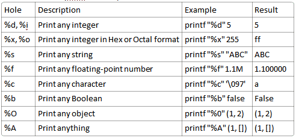

# I. The Basics of C++

## I. Compiler Toolchain (Preprocessor --> Compiler --> Linker)

### A. Preprocessor

- Converts library imports and source files into **translation units**
- Sends **translation units** to the *compiler*

### B. Compiler

- Converts **translation units** into **object files**
- Object files are written in unreadable *object code*

--> 1 Translation Unit **=** 1 Object File

- Object files are sent to the linker

### C. Linker

- Combines all the object files from the translation unit into a single program for execution

## II. C++ is Strongly Typed

- Each object is a preset **immutable** data type (unless you cast it)

## III. Print Specifier

---
</br></br>

# The Things I Know

### Hello World

```
// Import standard IO library
#include <cstdio>

// Entry point
int main() {
    printf("Hello World!");
    return 0; // Exit Code
}
```

##### Object Initialization
```
int some_value = 42;
int some_other_value = 42 / 2; 
```

##### Conditional Statements
```
if (some_other_value > 0) {
    printf("some_other_value is positive!");
}
else {
    ...
}
```

## printf
- Format specifiers start with a **%**

```
int main() {
    printf("Ten %d, Twenty %d", 10, 20);
    return 0;
}
```

- **%d** is the format specifier for an **int** 


